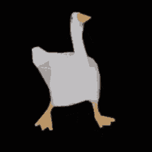

# 🦆☕ About Me :
✨ Welcome! I'm Kevin Moreira, known digitally as NetMalware. Future Full-Stack Developer and System Analysis student.

Actually, my focus is work in personal portfolio, where i can explore technologies like: Python, Html/Css/Javascript and some Databases like MySQL & MongoDB, for example.

Are you ready to improve your ideas in code?! get connected! 💡

## 🌐Socials
       

# 💻Tech Stack
                                          	               
# 📊GitHub Stats :

  
   
  

 
    
      
    
      
    
  

## 🏆GitHub Trophies

  <b><i>"Software is like sex: it’s better when it’s free."</i></b>

  — <strong>Linus Torvalds</strong>

